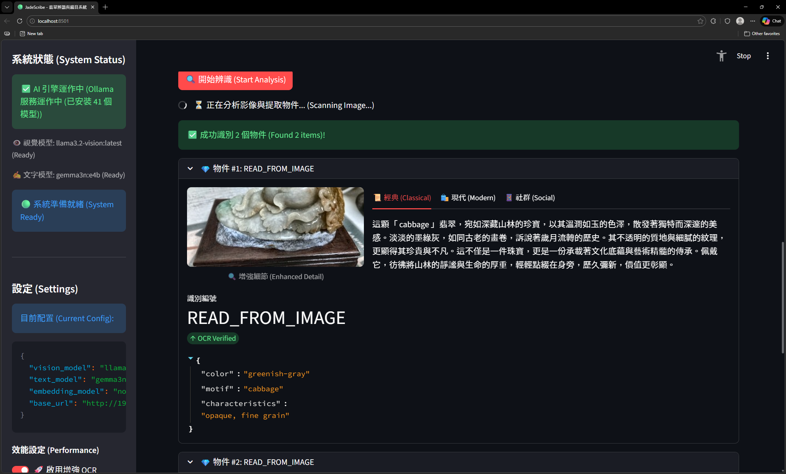
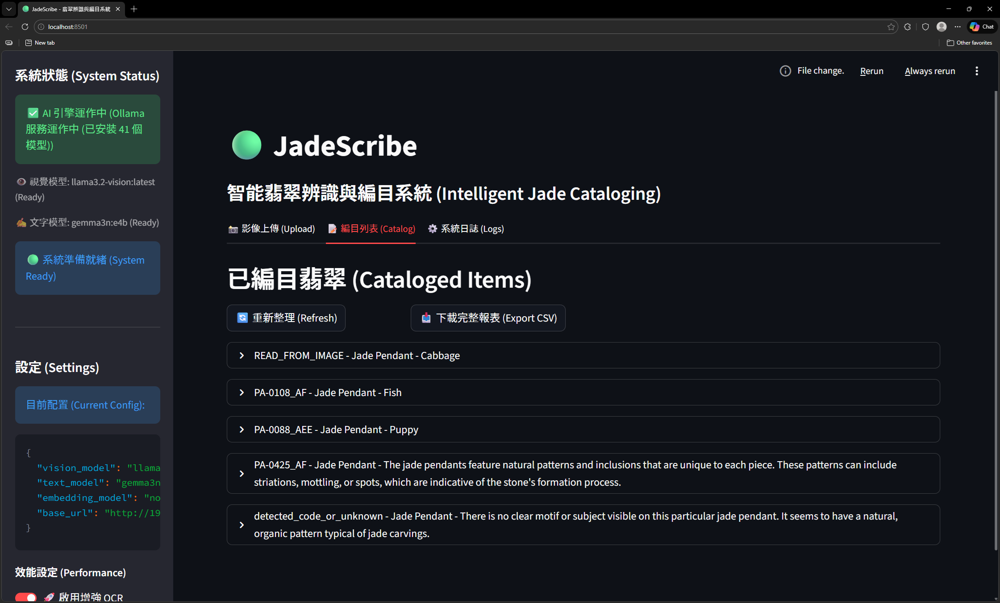
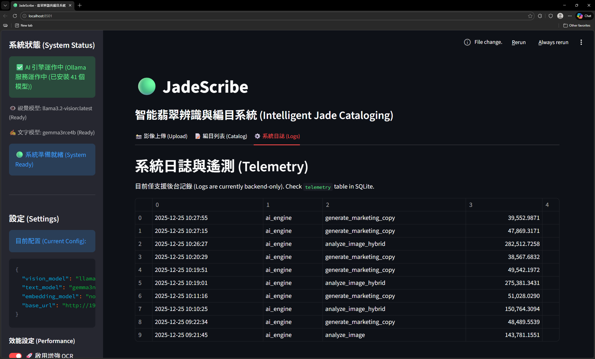

# 🟢 JadeScribe

[繁體中文](README.md) | [English](README_EN.md)

**JadeScribe** is an AI-powered cataloging assistant designed for high-end jade jewelry. Running entirely locally, it analyzes images, extracts item codes, and generates culturally rich marketing copy in Traditional Chinese.



## ✨ Key Features

*   **👁️ Advanced Vision Analysis**
    *   **High Performance**: Supports **`moondream:latest`** for lightning-fast analysis (~30s per item) with minimal resource footprint.
    *   **Remote AI Engine**: Connect to high-performance remote Ollama servers to offload heavy computation.
    *   **Batch Scanning**: Scans entire trays of jewelry, detecting multiple pendants and their Item Codes (OCR) simultaneously.

*   **📤 Batch & Multi-window Processing**
    *   **Multi-file Upload**: Select and process multiple images at once.
    *   **Multi-window Support**: Open multiple browser tabs to process different files independently and simultaneously.
    *   **Real-time Progress**: Detailed progress tracking for each step of the batch analysis.

*   **✍️ 3-Style Marketing Suite**
    *   **📜 Hero (Classical)**: Poetic and elegant, weaving in cultural symbolism (e.g., "Bamboo symbolizes resilience"). Ideal for brand catalogs.
    *   **🛍️ Modern (E-commerce)**: Direct and feature-focused (bullet points), highlighting wearability. Perfect for online store listings.
    *   **📱 Social (Viral)**: Short, engaging, and hashtag-rich. Ready for Instagram, Little Red Book (Xiaohongshu), or WeChat Moments.

*   **🏪 Cataloging & Operations**
    *   **Web Preview**: Simulate how your product descriptions look on a luxury e-commerce site directly within the app.
    *   **CSV Export**: One-click download of your entire inventory, formatted for easy import into Shopify, WooCommerce, or ERP systems.

*   **🛡️ Enterprise Grade Reliability**
    *   **Auto-Healing Database**: Automatically detects corruption, creates backups, and rebuilds the schema to keep the app running.
    *   **Resilient AI**: Built-in retry logic and smart JSON parsing ensure success even if the AI model hiccups.

---

## 🚀 Quick Start

### Prerequisites
*   **Python 3.10+**
*   **[Ollama](https://ollama.com/)** (Installed and running in background)
*   **Required Models**:
    Run the following in your terminal:
    ```bash
    ollama pull moondream:latest        # Lightweight Vision (Recommended)
    ollama pull llava:latest            # High Precision Vision (Optional)
    ollama pull gemma3n:e4b             # Text Generation
    ```

### Installation

1.  **Clone Repository**
    ```bash
    git clone https://github.com/yourusername/JadeScribe.git
    cd JadeScribe
    ```

2.  **Setup Virtual Environment**
    ```bash
    python -m venv .venv
    # Windows
    .venv\Scripts\activate
    # macOS/Linux
    source .venv/bin/activate
    ```

3.  **Install Dependencies**
    ```bash
    pip install -r requirements.txt
    ```

### Running the App
```bash
streamlit run src/app.py
```
The application will open automatically at `http://localhost:8501`.

---

## 📖 User Guide

### 1. Upload
Go to the **"📸 Upload"** tab. Drag & drop your jade photo. The system checks your AI connection automatically. Click **"🔍 Start Analysis"**.

### 2. Review & Generate
Once scanned, the system lists all detected items. Expand an item to see its code and features. Switch tabs to view the **Classic, Modern, and Social** copy variations.

### 3. Catalog & Export
Switch to the **"📝 Catalog"** tab:
*   **Web Preview**: Check the box next to an item to see a mock product page.
*   **Export**: Click **"📥 Export CSV"** to download your data.



### 4. Reset
To wipe all data (e.g., for a fresh demo), go to the sidebar **"⚠️ Danger Zone"** and click **"Reset Database"**, or run:
```bash
python reset.py
```

### 5. System Logs
Switch to the **"⚙️ System Logs"** tab to view detailed backend logs, including API response status and error messages.



---

## 🏗️ Architecture
*   **Frontend**: Streamlit (Python Web UI)
*   **AI Backend**: Ollama (Local LLM)
    *   Vision: `llama3.2-vision`
    *   Text: `gemma3n:e4b` (Localized for Traditional Chinese)
*   **Database**: SQLite (Local file-based, Auto-healing)
*   **Knowledge Base**: `data/symbolism_glossary.json`

## 📄 License
MIT License. See [LICENSE](LICENSE) for details.
